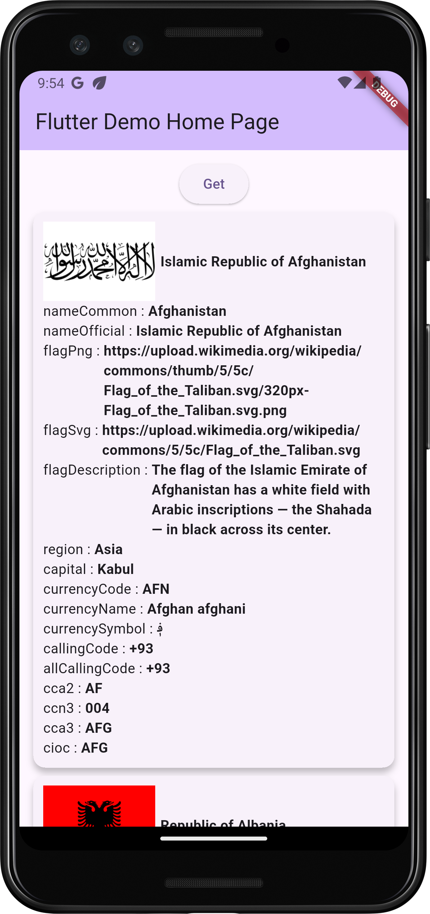
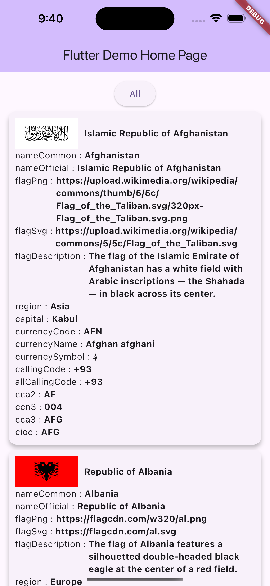
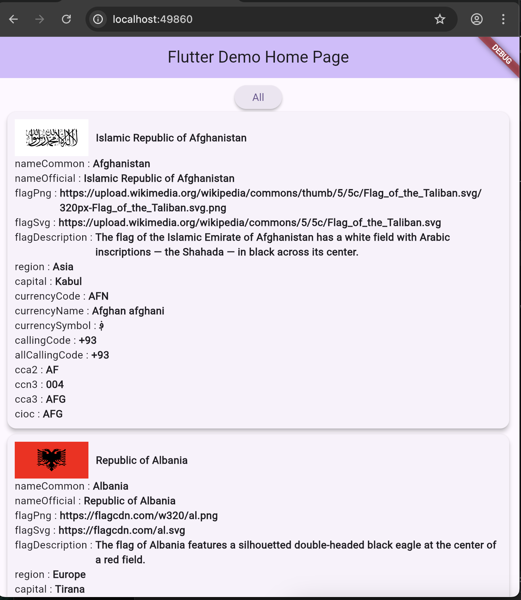

# flutter_countries package

This `flutter_countries` package totally supporst for `iOS`, `Android` , `Web`, `Linux` and `MacOS`.  

## Featrues
The `flutter_countries` intends to get the data of the countries over the world easily.

## How to use

### Android
Add `INTERNET` permission in `AndroidManifest.xml`
```Java
<uses-permission android:name="android.permission.INTERNET"/>
```

To get data, use `FlutterCountriesUtilities` directly. It will return `CountryData` with list.
```dart
List<CountryData>? mDataList = await FlutterCountriesUtilities.getCountries();
```
In `CountryData`, the following fields will include ..  
```dart
   String? nameCommon;
   String? nameOfficial;
   String? flagPng;
   String? flagSvg;
   String? flagDescription;
   String? region;
   String? capital;
   String? currencyCode;
   String? currencyName;
   String? currencySymbol;
   String? callingCode;
   List<String>? allCallingCode;
   String? cca2;
   String? ccn3;
   String? cca3;
   String? cioc;
```

## DEMO

| Android Demo | iOS Demo                                                             | Web Demo                                                             |
|--------------|----------------------------------------------------------------------|----------------------------------------------------------------------|
|  |  |  |
